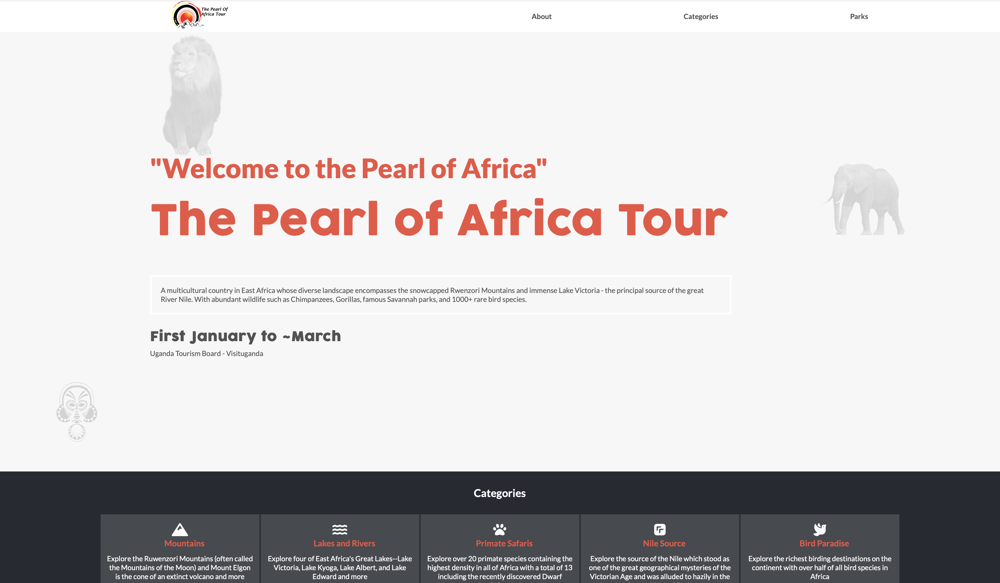

# Capstone

The project is a website for the Pearl of Africa tour which is organised annually and brings together tourists from all over the world.

The website provides more information about the tour as well as view the different gameparks available on the tour.

## Built With

- HTML
- Css
- Javascript

## Live Demo

[Live Demo Link](https://matovu-farid.github.io/Capstone/)

## Getting Started

To get the content of this project locally you need to run this command in your terminal:

- git clone your https://github.com/matovu-farid/Capstone.git
- cd project Capstone

## Authors

👤 **Matovu Farid Nkoba**

- GitHub: [@matovu-farid](https://github.com/matovu-farid)
- Twitter: [@matovu100](https://twitter.com/matovu100)
- LinkedIn: [matovu-farid](https://www.linkedin.com/in/matovu-farid-48b80257)

## ⭐️ Acknowledgement
- [original design idea by Cindy Shin in Behance](https://www.behance.net/adagio07)

## 🤝 Contributing

Contributions, issues, and feature requests are welcome!

Feel free to check the [issues page](../../issues/).

## Show your support

Give a ⭐️ if you like this project!

## 📝 License

This project is [MIT](./MIT.md) licensed.
